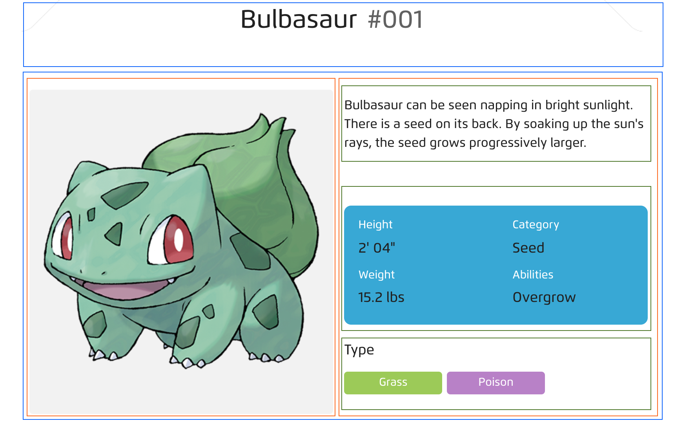
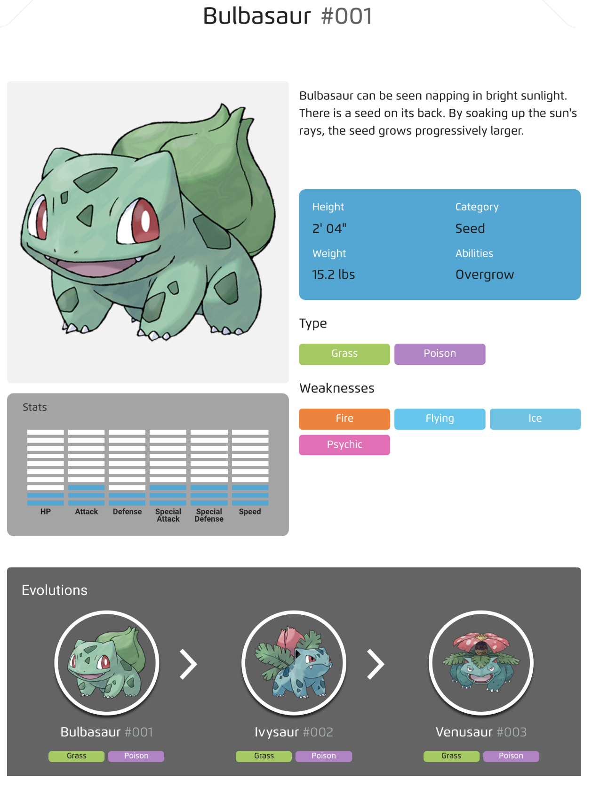

# Pokedex CSS

You will be creating the HTML and CSS for an online pokedex page. This one is for Bulbasaur.

Begin with the simplest version and add from there.

Remember to start by defining the boxes that comprise the layout. 

---

Here's the above with some boxes surrounding the major elements to create the layout:

---

When you are done with that add in some more details to your page.

