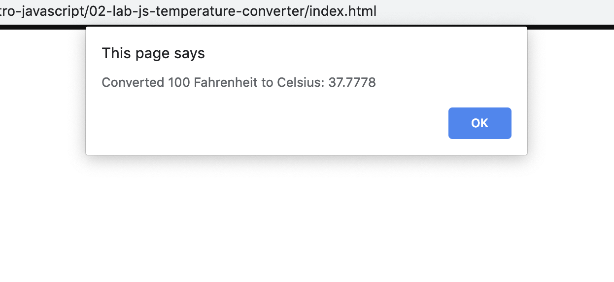

# Temperature converter program

You will be writing your first program! It is a temperature converter.

Write your implementation of the program in main.js. As you write the program, open index.html and provide an input (in Fahrenheit) so that your program receives the value and can work with it.

#### Instructions

* Open index.html in your browser and keep open the Browser Console
* Start by ensuring that you can capture user input into the variable `userInput`. How can you do that with the console?
  * Hint: Can you print a value of a variable in the console from your .js file?
* Next, use arithmetic operators (plus, minus, times, divide) to compute the conversion from F to C. How can you see the result of this computation?
* Finally, uncomment the last line of code in main.js (the one that starts with `alert(...)`) and check that your program shouts back the converted value at you in the browser!

#### Solution

