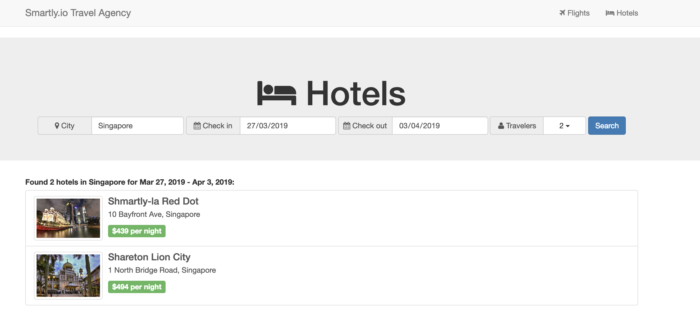

# Get data from a hosted JSON feed

#### Scenario

A client has a website that shows a bunch of hotel listings. The website actually uses an internal API to fetch the hotels data from their server. In other words, their website front-end is making a HTTP request to a server to obtain access to a Feed with hotel data.

Let's make use of their hosted feed to replicate a simple version of their website on our own.

#### Instructions

* The API endpoint for accessing their hotel feed is: https://miikka-smartlyio.github.io/travel-demo/hotels.json
* Use `XMLHttpRequest` to make a HTTP request to their hotel feed endpoint
* The response should be a JSON array of objects. Loop through each object and print the `name` of each hotel in the browser console
* Now, instead of console logging, use DOM Manipulation to add a list of hotel names (using `<ul>` and `<li>`) to the webpage

#### Bonus

* Do the same HTTP request but this time use [`Fetch`](https://developer.mozilla.org/en-US/docs/Web/API/Fetch_API/Using_Fetch) instead of `XMLHttpRequest`
* Make use of all their hotel data returned in the response. Show the data in an visual manner on the webpage as if you are re-creating their hotel listing website