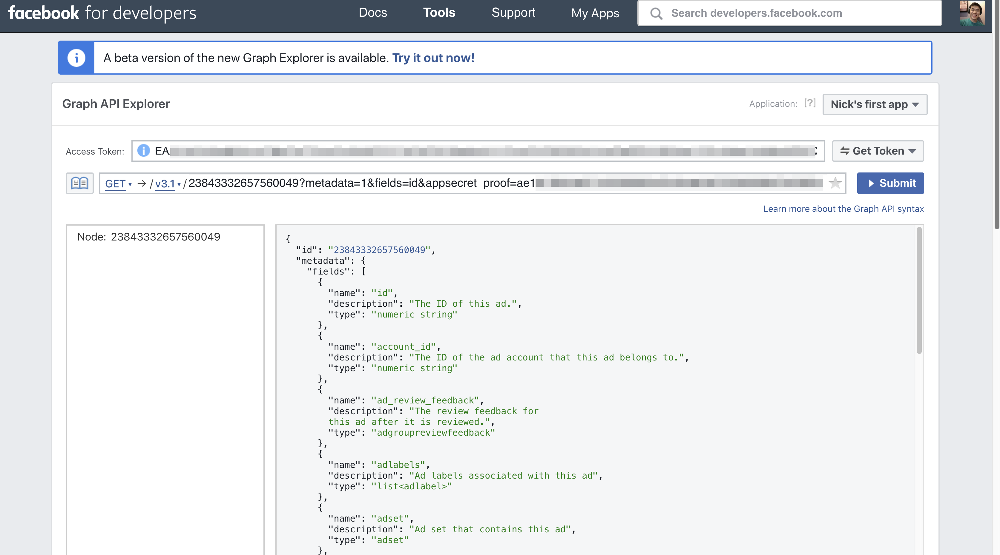

# Facebook Graph API Explorer



The FB Graph API is an API created by Facebook that is designed for third-party developers to access data that is stored in Facebook. In our case, Smartly.io is the third-party.

Commonly requested data via FB Graph API:

* Campaign
* Adset
* Ad
* Page
* User account
* Catalog
* Custom Audience
* etc.

FB's Graph API can be pinged in two broad ways:

1. Using Facebook's own [Graph API Explorer tool](https://developers.facebook.com/tools/explorer/?method=GET)
2. Using your own code (eg. JavaScript, Python, command line)

In this lab, our goal is to learn how to use FB's own Graph API Explorer tool to access data on Facebook.

## Part 1: Smartly.io FBLint --> FB Graph API Explorer

Starting a session from scratch in the Graph API Explorer is tedious. You need to copy-paste your access token and so on.

Smartly.io's FBLint, which is an internal debugging tool, can pre-fill all the necessary tokens and secrets into the Graph API Explorer. You just have to click a link from FBLint and in the new tab with the Graph API Explorer, just hit Submit.

#### Instructions

1. Login to Smartly and navigate to your own Ad Account
2. Find a random Campaign that exists in the account --> Turn on debug mode and debug the Campaign
3. Find the "Open in graph api explorer" link and click on it
    * Note: You may need to create a Facebook Developer account before being able to see the Graph API Explorer. It's free.
4. In the newly opened tab, which shows the Graph API Explorer, click "Submit"
5. What response did you get from the request?

You likely saw a response like this:

```json
{
  "id": "10154222917793770"
}
```

It looks like you received the `id` field of the campaign. What other fields can we request for?

1. Add a new parameter and value to the URL `&metadata=1` just after `fields=id`
2. Click Submit and see the new response
3. Using this new information, answer these questions about this Campaign:
    * What is the name of this Campaign?
    * What is the Campaign's FB objective?
    * Which ad account does this Campaign belong in?
    * What is the current status of the Campaign (eg. paused, active, etc.)?
    * Does FB have any recommendations about this Campaign?

__Hint__: the `fields=` URL parameter can take in multiple fields separated by comma. For example, `.../?fields=id,name`.

## Part 2: Getting related objects with edges

The object whose data we requested for above is a Campaign object. We know that a Campaign in Facebook can have many Adsets. How can we get information about the Adsets in this Campaign?

Here's a bit more technical details that is useful to know about the FB Graph API:

* You are always looking at a particular "Node". Think of nodes as leaves on a tree branch. In the above exercise, the Campaign object is the Node we are requesting data for
* A Node can have related data called an edges. Think of edges as the connections to other objects in the Graph API
* An example edge of a Campaign node is "adsets"

#### Instructions

1. Make a query for the Campaign node with the `metadata=1` parameter in the URL
2. Scroll down in the response and find the `connections` key. These are the available edges you can ask FB for regarding this Campaign
3. Using the information from the `connections` key in the response, modify your Graph API Explorer query to request for the Adsets related to this Campaign
4. Now query for Ads related to this Campaign
5. Finally, find out more information about the first Ad you find in this Campaign by changing the Node you are requesting from a Campaign ID to an Ad ID. Get the Ad's name, status, and the creative ID

