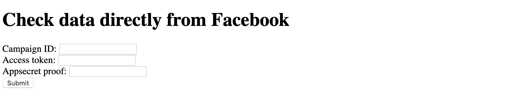

# Ping FB API using JavaScript

In this lab, you will create a user interface for making queries to the Facebook Graph API.

You are free to decide whether you prefer to use [`XMLHttpRequest`](https://developer.mozilla.org/en-US/docs/Web/API/XMLHttpRequest/Using_XMLHttpRequest) or [`Fetch`](https://developer.mozilla.org/en-US/docs/Web/API/Fetch_API/Using_Fetch) to make the HTTP requests in JavaScript.

## Part 1: A simple FBLint

Our FBLint tool was built to make it easy for Smartlies to quickly find information from The Ultimate Source of Truth™ that is Facebook. Now let's make our own version of FBLint. 

We will start easy, and eventually make it slightly more useful than our actual FBLint! For specific use cases, that is.

#### Instructions

Use the index.html and main.js files included in this directory as your starter code.

1. When user fills up the form with Campaign ID, appsecret proof, and access token, and clicks Submit, send a HTTP request to https://graph.facebook.com/v3.1/xxx/?fields=id where `xxx` is the user's input
    * For example, if user enters "248350856049603" in the input element, send a GET request to https://graph.facebook.com/v3.1/248350856049603/?fields=id
2. Modify the URL to query for more data about the Campaign. Query for the Campaign's name, created time, effective status, objective, account id, and daily budget
3. Display the response data in JSON format directly on the webpage for the user to see

## Part 2: A custom FBLint

In Regular campaigns on Facebook, every Ad has a Creative, and in the Creative, there is a FB Post.

Currently in our [FBLint](https://app.smartly.io/admin/fblint), finding out the Post used by an Ad requires a few knowing clicks:

> Debug Ad --> find and click creative_id --> find and click post_id --> obtain FB Post ID

Let's build our own custom FBLint that does all this "clicking" behind the scenes. The end goal should fulfill this user story:

* As a user, I should be able to enter an Ad ID and get the correspodning Post ID used in the particular Ad

__Careful__: Dynamic Ads do not have a FB Post in the Creative, so make sure you are working with a random Regular Campaign for this part of the lab!

#### Instructions

1. Add a fourth `<input>` element to obtain Ad ID from the user
2. Write logic to handle the case where user inputs both Campaign ID and Ad ID. Campaign should take priority if both fields are filled up
3. Using the input Ad ID, make a first request to FB Graph API to obtain information about the Ad
    * Use `metadata=1` to find out which field contains the information about the Creative, and request for that field
4. With the Creative ID used in this Ad, make a second request to obtain information about the Creative
    * Use `metadata=1` to find out which field contains the information about the Post, and request for that field
5. The Post ID should be in the format of `<page_id>_<post_id>`, eg. "1802151736501460_2028269420556356". Check that you got the correct field value
6. Using DOM manipulation, add to the page:
    * The Post ID
    * A clickable URL to the FB Post (__Hint__: Posts on FB follow this URL format: `www.facebook.com/<page_id>_<post_id>`)

#### Bonus

1. Display the Ad ID, Creative ID, as well as the Post ID on the page. 
2. Read FB documentation and find out how you can obtain an Ad preview for an Ad. Modify your code so that when a user submits an Ad ID, they can also see a preview of the Ad in the page.
    * Hint: the response from FB Marketing API for ad preview will be an `<iframe>` element. Read more on MDN to know how to work with it. It's not too complicated!