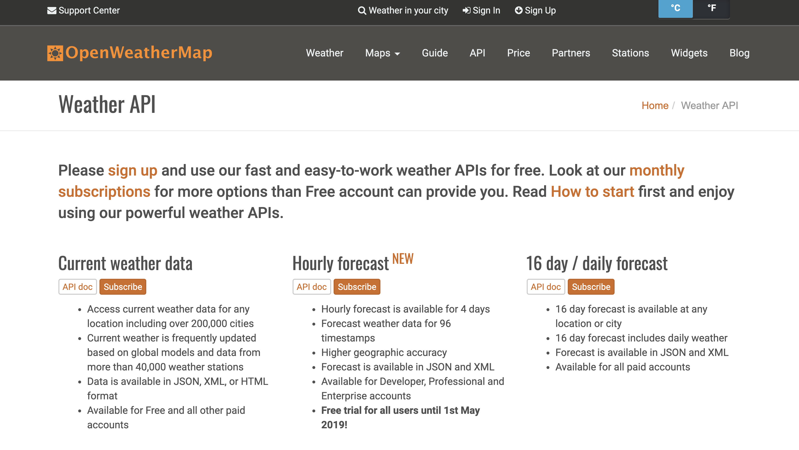
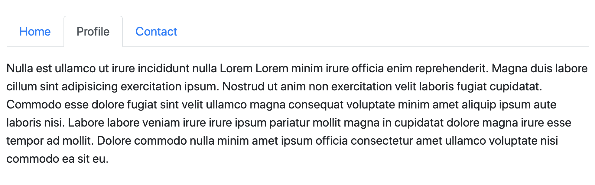

# Temperature converter app (with bonus city weather checker challenge)

Remember your old temperature converter app? Let's make it actually usable and presentable.

You are free to reuse your code from [week 5](../../05-intro-javascript/02-lab-js-temperature-converter/README.md) for this lab. However, convert all your code to __use jQuery and Bootstrap for faster development__.

### 0. Setup external libraries

* Add a `<script>` tag to load jQuery
* Add a `<link>` tag to load Bootstrap
    * Optionally, load the related JavaScript libraries needed for Bootstrap's JavaScript-controlled components to work with `<script>` tags
* Test that jQuery works by console logging `$`
* Test that Bootstrap works by using one of their built-in HTML components
    * eg. `
Some attention-grabbing text
`

### 1. Input instead of prompt

* Use `<input>` elements to obtain the user's input temperature for conversion
* After conversion, display the converted value on the page using DOM manipulation (no page refresh)

### 2. Two-way conversion

* Make it possible for the user to convert from Fahrenheit to Celsius, and vice versa
    * You are free to decide how you want this to be achieved (eg. dropdown, radio button, or simply two inputs)

### 3. Mood-setting pictures

* Show an accompanying picture depending on the temperature that is input
    * eg. If less than 15 degrees, show a person wearing a jacket
    * eg. If between 15 and 25 degrees, show a person in t-shirt and jeans
    * eg. If more than 25 degrees, show a person wearing a singlet and shorts
* Ensure the image changes every time with a new input temperature

### Bonus 1: Show current city weather with OpenWeather API

* Sign up and obtain API key from [OpenWeatherMap](https://openweathermap.org/) (may take 1-2 hours for API key to be activated)
* Add a second section to your web app that takes in a city name via another `<input>` element
* Make HTTP request using the city to OpenWeatherMap API to obtain current weather data for that city
* Display the weather on the UI, including `temperature`, `wind`, and `cloudiness` data

### Bonus 2: Separate functionality into tabs

* Use Bootstrap (with Bootstrap JavaScript) to separate the temperature converter and weather checker into 2 tabs
    * At any time, only 1 tab's content is shown in the UI. The other is hidden
